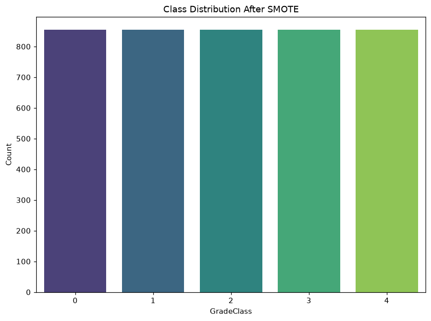
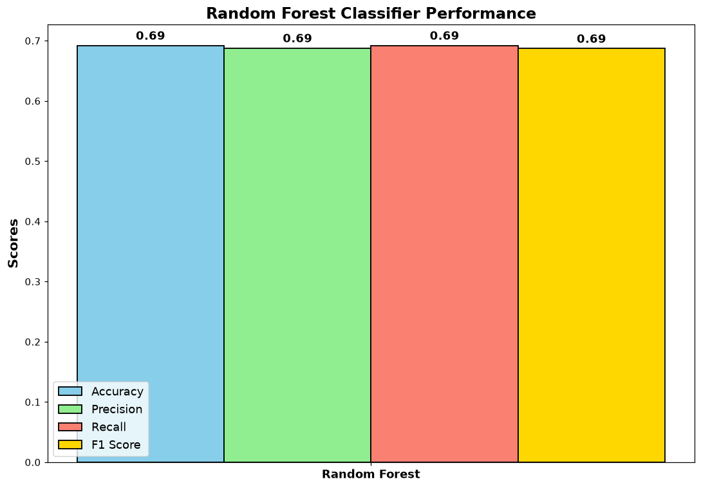
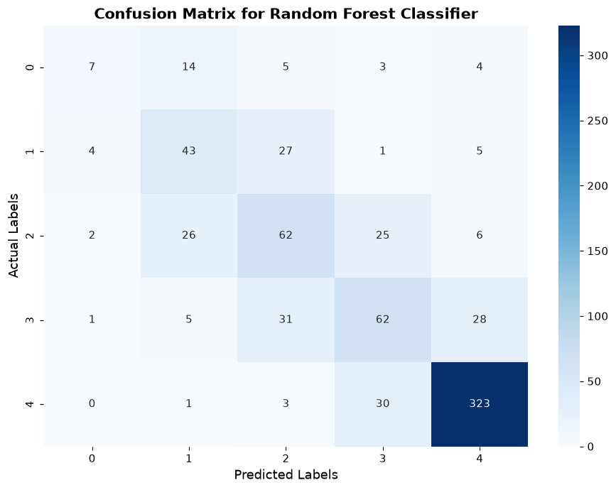
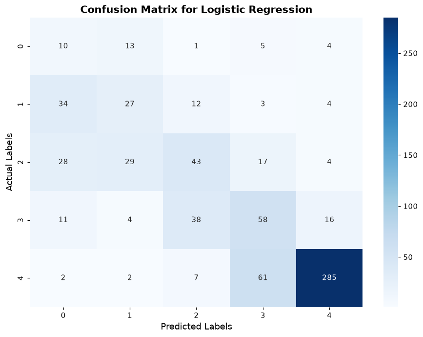
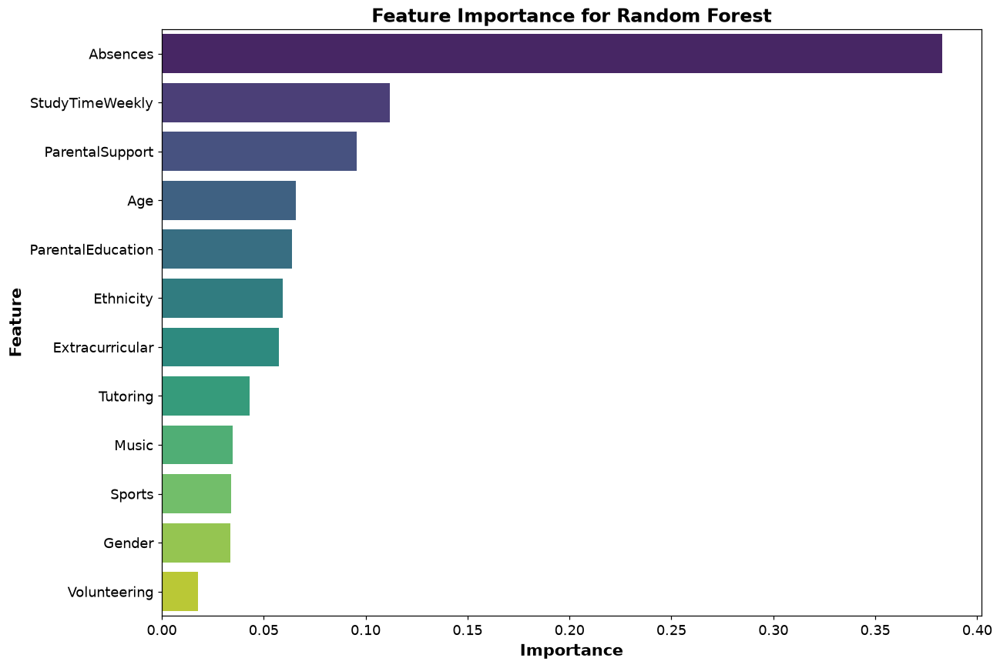
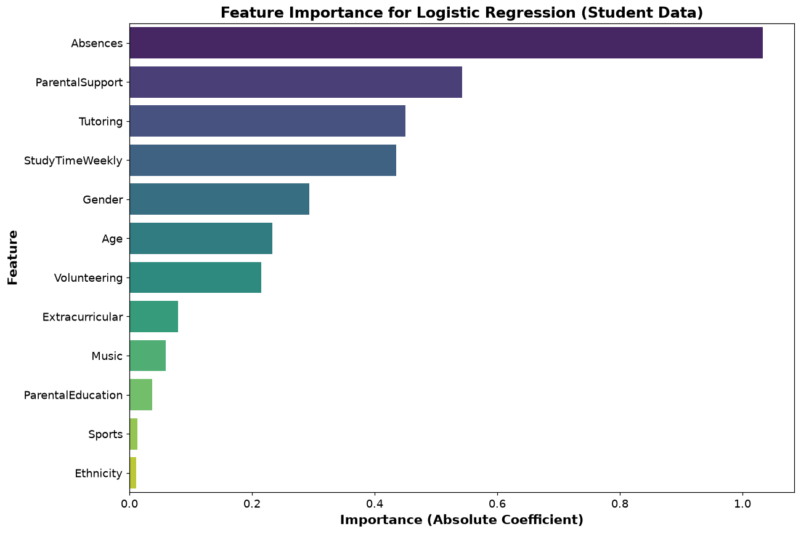

# Student Grade Prediction with Machine Learning

A machine learning project that predicts a student's **grade class (A–F)** from study habits, attendance, parental involvement and extracurricular activities. It compares **Random Forest** and **Logistic Regression**, uses **SMOTE** to handle class imbalance, and applies **GridSearchCV** to tune hyperparameters.

This project was completed for the *Introduction to Artificial Intelligence* module at university.

## Project Overview

Spotting students at risk of low grades early lets teachers step in sooner. This project trains classification models to predict each student's `GradeClass` and identifies which factors influence academic performance the most.

## Dataset

- **2,392 students**, 15 columns ([Students Performance Dataset on Kaggle](https://www.kaggle.com/datasets/rabieelkharoua/students-performance-dataset))
- **Features:** Age, Gender, Ethnicity, Parental Education, Weekly Study Time, Absences, Tutoring, Parental Support, Extracurricular activities, Sports, Music, Volunteering
- **Target:** `GradeClass`

| GradeClass | Grade | Students |
|---|---|---|
| 0 | A | 107 |
| 1 | B | 269 |
| 2 | C | 391 |
| 3 | D | 414 |
| 4 | F | 1,211 |

The classes are heavily imbalanced: about half the students are in grade F, and fewer than 5% are in grade A.

## Workflow

### 1. Preprocessing
- **Missing values:** the original dataset had none, so some were introduced for practice. Numeric columns were filled with the column mean, and the rest with 0.
- **Outliers:** detected with the IQR method (values outside Q1 − 1.5×IQR and Q3 + 1.5×IQR).
- **Encoding:** categorical variables were label-encoded.
- **Dropped columns:** `StudentID` (an identifier) and `GPA`, since GradeClass is derived directly from GPA and keeping it would leak the answer.
- **Scaling:** `StandardScaler`.
- **Split:** 70% training, 30% testing.

### 2. Handling Class Imbalance – SMOTE
SMOTE (Synthetic Minority Oversampling Technique) was applied to the **training set only**, creating synthetic examples of the rarer grades so every class is equally represented during training.



### 3. Models and Tuning
| Model | Hyperparameters tuned (GridSearchCV, 5-fold CV) |
|---|---|
| Random Forest | `n_estimators`, `max_depth`, `max_features` |
| Logistic Regression | `C`, `solver` (best: `C=10`, `solver='lbfgs'`) |

## Results

Test set: 718 students. Precision, recall and F1 are weighted averages across the 5 grade classes.

| Model | Accuracy | Precision | Recall | F1-Score |
|---|---|---|---|---|
| **Random Forest** | **69%** | **69%** | **69%** | **69%** |
| Logistic Regression | 59% | 64% | 59% | 61% |

**Random Forest performed best.** It predicts grade F very well (F1 = 0.89) because that class is large and distinctive. The middle grades B, C and D are harder to separate, as they often get confused with their neighbouring grade. Grade A remains the most difficult because it has so few real examples.



**Confusion matrices**





Logistic Regression's linear decision boundaries caused more confusion between neighbouring grades, particularly for students in grade B, who were often predicted as grade A.

## Feature Importance

Both models agree that **absences** are by far the strongest predictor of a student's grade, followed by **weekly study time** and **parental support**. Demographic factors such as gender and ethnicity matter very little.





## Key Learnings
- **Class imbalance matters:** SMOTE gave the models a fair chance to learn the rarer grades.
- **Tree-based models handle complex patterns better:** Random Forest captured non-linear relationships that Logistic Regression missed.
- **Actionable insights:** attendance, study time and parental support are the factors schools can actually influence, which makes them useful targets for interventions.

## Possible Improvements
- Try gradient boosting models such as XGBoost or LightGBM
- Use stratified splitting to keep grade proportions the same in the training and test sets
- Treat the grades as ordinal, since grade A is closer to B than to F

## How to Run

1. Clone the repository:
   ```bash
   git clone https://github.com/noorbushra470-alt/student-grade-prediction.git
   cd student-grade-prediction
   ```
2. Install the dependencies:
   ```bash
   pip install -r requirements.txt
   ```
3. Run the script. It trains the models, prints the results and displays the charts:
   ```bash
   python Main.py
   ```

## Tech Stack
Python · Pandas · NumPy · Scikit-learn · Imbalanced-learn (SMOTE) · Matplotlib · Seaborn · Joblib
